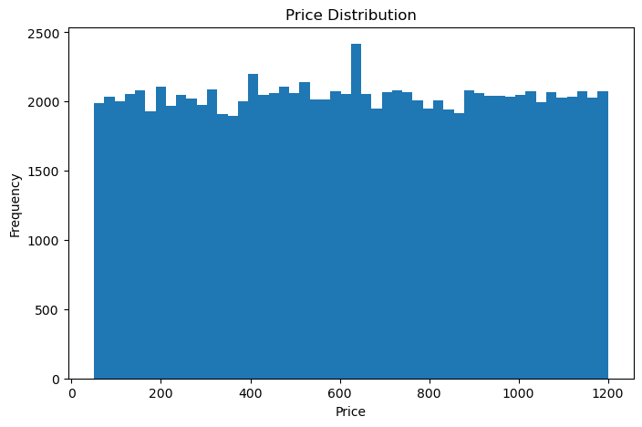
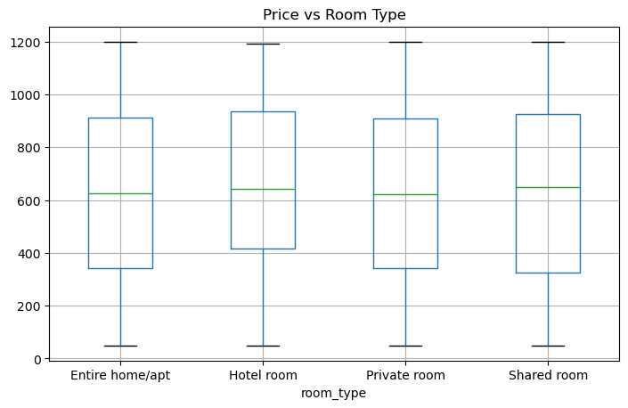

```python
# Importa pandas
import pandas as pd
```


```python
# Import raw data file
data = pd.read_csv("C:\\Users\\rahul\\Downloads\\Airbnb_Open_Data.csv")

```

    C:\Users\rahul\AppData\Local\Temp\ipykernel_30264\3774807840.py:1: DtypeWarning: Columns (25) have mixed types. Specify dtype option on import or set low_memory=False.
      data = pd.read_csv("C:\\Users\\rahul\\Downloads\\Airbnb_Open_Data.csv")
    


```python
# panda not read mix data 
data = pd.read_csv("C:\\Users\\rahul\\Downloads\\Airbnb_Open_Data.csv", low_memory=False)

```


```python
# checking heading and data upload? 
data.head()
```


<div>
<style scoped>
    .dataframe tbody tr th:only-of-type {
        vertical-align: middle;
    }

    .dataframe tbody tr th {
        vertical-align: top;
    }

    .dataframe thead th {
        text-align: right;
    }
</style>
<table border="1" class="dataframe">
  <thead>
    <tr style="text-align: right;">
      <th></th>
      <th>id</th>
      <th>NAME</th>
      <th>host id</th>
      <th>host_identity_verified</th>
      <th>host name</th>
      <th>neighbourhood group</th>
      <th>neighbourhood</th>
      <th>lat</th>
      <th>long</th>
      <th>country</th>
      <th>...</th>
      <th>service fee</th>
      <th>minimum nights</th>
      <th>number of reviews</th>
      <th>last review</th>
      <th>reviews per month</th>
      <th>review rate number</th>
      <th>calculated host listings count</th>
      <th>availability 365</th>
      <th>house_rules</th>
      <th>license</th>
    </tr>
  </thead>
  <tbody>
    <tr>
      <th>0</th>
      <td>1001254</td>
      <td>Clean &amp; quiet apt home by the park</td>
      <td>80014485718</td>
      <td>unconfirmed</td>
      <td>Madaline</td>
      <td>Brooklyn</td>
      <td>Kensington</td>
      <td>40.64749</td>
      <td>-73.97237</td>
      <td>United States</td>
      <td>...</td>
      <td>$193</td>
      <td>10.0</td>
      <td>9.0</td>
      <td>10/19/2021</td>
      <td>0.21</td>
      <td>4.0</td>
      <td>6.0</td>
      <td>286.0</td>
      <td>Clean up and treat the home the way you'd like...</td>
      <td>NaN</td>
    </tr>
    <tr>
      <th>1</th>
      <td>1002102</td>
      <td>Skylit Midtown Castle</td>
      <td>52335172823</td>
      <td>verified</td>
      <td>Jenna</td>
      <td>Manhattan</td>
      <td>Midtown</td>
      <td>40.75362</td>
      <td>-73.98377</td>
      <td>United States</td>
      <td>...</td>
      <td>$28</td>
      <td>30.0</td>
      <td>45.0</td>
      <td>5/21/2022</td>
      <td>0.38</td>
      <td>4.0</td>
      <td>2.0</td>
      <td>228.0</td>
      <td>Pet friendly but please confirm with me if the...</td>
      <td>NaN</td>
    </tr>
    <tr>
      <th>2</th>
      <td>1002403</td>
      <td>THE VILLAGE OF HARLEM....NEW YORK !</td>
      <td>78829239556</td>
      <td>NaN</td>
      <td>Elise</td>
      <td>Manhattan</td>
      <td>Harlem</td>
      <td>40.80902</td>
      <td>-73.94190</td>
      <td>United States</td>
      <td>...</td>
      <td>$124</td>
      <td>3.0</td>
      <td>0.0</td>
      <td>NaN</td>
      <td>NaN</td>
      <td>5.0</td>
      <td>1.0</td>
      <td>352.0</td>
      <td>I encourage you to use my kitchen, cooking and...</td>
      <td>NaN</td>
    </tr>
    <tr>
      <th>3</th>
      <td>1002755</td>
      <td>NaN</td>
      <td>85098326012</td>
      <td>unconfirmed</td>
      <td>Garry</td>
      <td>Brooklyn</td>
      <td>Clinton Hill</td>
      <td>40.68514</td>
      <td>-73.95976</td>
      <td>United States</td>
      <td>...</td>
      <td>$74</td>
      <td>30.0</td>
      <td>270.0</td>
      <td>7/5/2019</td>
      <td>4.64</td>
      <td>4.0</td>
      <td>1.0</td>
      <td>322.0</td>
      <td>NaN</td>
      <td>NaN</td>
    </tr>
    <tr>
      <th>4</th>
      <td>1003689</td>
      <td>Entire Apt: Spacious Studio/Loft by central park</td>
      <td>92037596077</td>
      <td>verified</td>
      <td>Lyndon</td>
      <td>Manhattan</td>
      <td>East Harlem</td>
      <td>40.79851</td>
      <td>-73.94399</td>
      <td>United States</td>
      <td>...</td>
      <td>$41</td>
      <td>10.0</td>
      <td>9.0</td>
      <td>11/19/2018</td>
      <td>0.10</td>
      <td>3.0</td>
      <td>1.0</td>
      <td>289.0</td>
      <td>Please no smoking in the house, porch or on th...</td>
      <td>NaN</td>
    </tr>
  </tbody>
</table>
<p>5 rows × 26 columns</p>
</div>


```python
data.columns
```


    Index(['id', 'NAME', 'host id', 'host_identity_verified', 'host name',
           'neighbourhood group', 'neighbourhood', 'lat', 'long', 'country',
           'country code', 'instant_bookable', 'cancellation_policy', 'room type',
           'Construction year', 'price', 'service fee', 'minimum nights',
           'number of reviews', 'last review', 'reviews per month',
           'review rate number', 'calculated host listings count',
           'availability 365', 'house_rules', 'license'],
          dtype='object')


```python
data.info()

```

    <class 'pandas.core.frame.DataFrame'>
    RangeIndex: 102599 entries, 0 to 102598
    Data columns (total 26 columns):
     #   Column                          Non-Null Count   Dtype  
    ---  ------                          --------------   -----  
     0   id                              102599 non-null  int64  
     1   NAME                            102349 non-null  object 
     2   host id                         102599 non-null  int64  
     3   host_identity_verified          102310 non-null  object 
     4   host name                       102193 non-null  object 
     5   neighbourhood group             102570 non-null  object 
     6   neighbourhood                   102583 non-null  object 
     7   lat                             102591 non-null  float64
     8   long                            102591 non-null  float64
     9   country                         102067 non-null  object 
     10  country code                    102468 non-null  object 
     11  instant_bookable                102494 non-null  object 
     12  cancellation_policy             102523 non-null  object 
     13  room type                       102599 non-null  object 
     14  Construction year               102385 non-null  float64
     15  price                           102352 non-null  object 
     16  service fee                     102326 non-null  object 
     17  minimum nights                  102190 non-null  float64
     18  number of reviews               102416 non-null  float64
     19  last review                     86706 non-null   object 
     20  reviews per month               86720 non-null   float64
     21  review rate number              102273 non-null  float64
     22  calculated host listings count  102280 non-null  float64
     23  availability 365                102151 non-null  float64
     24  house_rules                     50468 non-null   object 
     25  license                         2 non-null       object 
    dtypes: float64(9), int64(2), object(15)
    memory usage: 20.4+ MB
    


```python
"""deleting redundant columns.
renming the columns.
dropping duplicates.
cleaning individual columns.
remove the NaN value from the dataset
check for some more transformation"""

```


    'deleting redundant columns.\nrenming the columns.\ndropping duplicates.\ncleaning individual columns.\nremove the NaN value from the dataset\ncheck for some more transformation'


```python
data.columns
```


    Index(['id', 'NAME', 'host id', 'host_identity_verified', 'host name',
           'neighbourhood group', 'neighbourhood', 'lat', 'long', 'country',
           'country code', 'instant_bookable', 'cancellation_policy', 'room type',
           'Construction year', 'price', 'service fee', 'minimum nights',
           'number of reviews', 'last review', 'reviews per month',
           'review rate number', 'calculated host listings count',
           'availability 365', 'house_rules', 'license'],
          dtype='object')


```python
columns_to_keep=['NAME', 'host id', 'host_identity_verified', 'host name',
       'neighbourhood group', 'neighbourhood', 'lat', 'long', 'country',
       'country code', 'instant_bookable', 'cancellation_policy', 'room type',
       'Construction year', 'price', 'service fee', 'minimum nights',
       'number of reviews', 'last review']

columns_to_drop=['reviews per month',
       'review rate number', 'calculated host listings count',
       'availability 365', 'house_rules', 'license','id']               
```


```python
len(columns_to_keep)
```


    19


```python
len(columns_to_drop)
```


    7


```python
#1st Filtering data
data[columns_to_keep]
```


<div>
<style scoped>
    .dataframe tbody tr th:only-of-type {
        vertical-align: middle;
    }

    .dataframe tbody tr th {
        vertical-align: top;
    }

    .dataframe thead th {
        text-align: right;
    }
</style>
<table border="1" class="dataframe">
  <thead>
    <tr style="text-align: right;">
      <th></th>
      <th>NAME</th>
      <th>host id</th>
      <th>host_identity_verified</th>
      <th>host name</th>
      <th>neighbourhood group</th>
      <th>neighbourhood</th>
      <th>lat</th>
      <th>long</th>
      <th>country</th>
      <th>country code</th>
      <th>instant_bookable</th>
      <th>cancellation_policy</th>
      <th>room type</th>
      <th>Construction year</th>
      <th>price</th>
      <th>service fee</th>
      <th>minimum nights</th>
      <th>number of reviews</th>
      <th>last review</th>
    </tr>
  </thead>
  <tbody>
    <tr>
      <th>0</th>
      <td>Clean &amp; quiet apt home by the park</td>
      <td>80014485718</td>
      <td>unconfirmed</td>
      <td>Madaline</td>
      <td>Brooklyn</td>
      <td>Kensington</td>
      <td>40.64749</td>
      <td>-73.97237</td>
      <td>United States</td>
      <td>US</td>
      <td>False</td>
      <td>strict</td>
      <td>Private room</td>
      <td>2020.0</td>
      <td>$966</td>
      <td>$193</td>
      <td>10.0</td>
      <td>9.0</td>
      <td>10/19/2021</td>
    </tr>
    <tr>
      <th>1</th>
      <td>Skylit Midtown Castle</td>
      <td>52335172823</td>
      <td>verified</td>
      <td>Jenna</td>
      <td>Manhattan</td>
      <td>Midtown</td>
      <td>40.75362</td>
      <td>-73.98377</td>
      <td>United States</td>
      <td>US</td>
      <td>False</td>
      <td>moderate</td>
      <td>Entire home/apt</td>
      <td>2007.0</td>
      <td>$142</td>
      <td>$28</td>
      <td>30.0</td>
      <td>45.0</td>
      <td>5/21/2022</td>
    </tr>
    <tr>
      <th>2</th>
      <td>THE VILLAGE OF HARLEM....NEW YORK !</td>
      <td>78829239556</td>
      <td>NaN</td>
      <td>Elise</td>
      <td>Manhattan</td>
      <td>Harlem</td>
      <td>40.80902</td>
      <td>-73.94190</td>
      <td>United States</td>
      <td>US</td>
      <td>True</td>
      <td>flexible</td>
      <td>Private room</td>
      <td>2005.0</td>
      <td>$620</td>
      <td>$124</td>
      <td>3.0</td>
      <td>0.0</td>
      <td>NaN</td>
    </tr>
    <tr>
      <th>3</th>
      <td>NaN</td>
      <td>85098326012</td>
      <td>unconfirmed</td>
      <td>Garry</td>
      <td>Brooklyn</td>
      <td>Clinton Hill</td>
      <td>40.68514</td>
      <td>-73.95976</td>
      <td>United States</td>
      <td>US</td>
      <td>True</td>
      <td>moderate</td>
      <td>Entire home/apt</td>
      <td>2005.0</td>
      <td>$368</td>
      <td>$74</td>
      <td>30.0</td>
      <td>270.0</td>
      <td>7/5/2019</td>
    </tr>
    <tr>
      <th>4</th>
      <td>Entire Apt: Spacious Studio/Loft by central park</td>
      <td>92037596077</td>
      <td>verified</td>
      <td>Lyndon</td>
      <td>Manhattan</td>
      <td>East Harlem</td>
      <td>40.79851</td>
      <td>-73.94399</td>
      <td>United States</td>
      <td>US</td>
      <td>False</td>
      <td>moderate</td>
      <td>Entire home/apt</td>
      <td>2009.0</td>
      <td>$204</td>
      <td>$41</td>
      <td>10.0</td>
      <td>9.0</td>
      <td>11/19/2018</td>
    </tr>
    <tr>
      <th>...</th>
      <td>...</td>
      <td>...</td>
      <td>...</td>
      <td>...</td>
      <td>...</td>
      <td>...</td>
      <td>...</td>
      <td>...</td>
      <td>...</td>
      <td>...</td>
      <td>...</td>
      <td>...</td>
      <td>...</td>
      <td>...</td>
      <td>...</td>
      <td>...</td>
      <td>...</td>
      <td>...</td>
      <td>...</td>
    </tr>
    <tr>
      <th>102594</th>
      <td>Spare room in Williamsburg</td>
      <td>12312296767</td>
      <td>verified</td>
      <td>Krik</td>
      <td>Brooklyn</td>
      <td>Williamsburg</td>
      <td>40.70862</td>
      <td>-73.94651</td>
      <td>United States</td>
      <td>US</td>
      <td>False</td>
      <td>flexible</td>
      <td>Private room</td>
      <td>2003.0</td>
      <td>$844</td>
      <td>$169</td>
      <td>1.0</td>
      <td>0.0</td>
      <td>NaN</td>
    </tr>
    <tr>
      <th>102595</th>
      <td>Best Location near Columbia U</td>
      <td>77864383453</td>
      <td>unconfirmed</td>
      <td>Mifan</td>
      <td>Manhattan</td>
      <td>Morningside Heights</td>
      <td>40.80460</td>
      <td>-73.96545</td>
      <td>United States</td>
      <td>US</td>
      <td>True</td>
      <td>moderate</td>
      <td>Private room</td>
      <td>2016.0</td>
      <td>$837</td>
      <td>$167</td>
      <td>1.0</td>
      <td>1.0</td>
      <td>7/6/2015</td>
    </tr>
    <tr>
      <th>102596</th>
      <td>Comfy, bright room in Brooklyn</td>
      <td>69050334417</td>
      <td>unconfirmed</td>
      <td>Megan</td>
      <td>Brooklyn</td>
      <td>Park Slope</td>
      <td>40.67505</td>
      <td>-73.98045</td>
      <td>United States</td>
      <td>US</td>
      <td>True</td>
      <td>moderate</td>
      <td>Private room</td>
      <td>2009.0</td>
      <td>$988</td>
      <td>$198</td>
      <td>3.0</td>
      <td>0.0</td>
      <td>NaN</td>
    </tr>
    <tr>
      <th>102597</th>
      <td>Big Studio-One Stop from Midtown</td>
      <td>11160591270</td>
      <td>unconfirmed</td>
      <td>Christopher</td>
      <td>Queens</td>
      <td>Long Island City</td>
      <td>40.74989</td>
      <td>-73.93777</td>
      <td>United States</td>
      <td>US</td>
      <td>True</td>
      <td>strict</td>
      <td>Entire home/apt</td>
      <td>2015.0</td>
      <td>$546</td>
      <td>$109</td>
      <td>2.0</td>
      <td>5.0</td>
      <td>10/11/2015</td>
    </tr>
    <tr>
      <th>102598</th>
      <td>585 sf Luxury Studio</td>
      <td>68170633372</td>
      <td>unconfirmed</td>
      <td>Rebecca</td>
      <td>Manhattan</td>
      <td>Upper West Side</td>
      <td>40.76807</td>
      <td>-73.98342</td>
      <td>United States</td>
      <td>US</td>
      <td>False</td>
      <td>flexible</td>
      <td>Entire home/apt</td>
      <td>2010.0</td>
      <td>$1,032</td>
      <td>$206</td>
      <td>1.0</td>
      <td>0.0</td>
      <td>NaN</td>
    </tr>
  </tbody>
</table>
<p>102599 rows × 19 columns</p>
</div>


```python
data.shape
```


    (102599, 26)


```python
# Rename header name 
data.columns
```


    Index(['id', 'NAME', 'host id', 'host_identity_verified', 'host name',
           'neighbourhood group', 'neighbourhood', 'lat', 'long', 'country',
           'country code', 'instant_bookable', 'cancellation_policy', 'room type',
           'Construction year', 'price', 'service fee', 'minimum nights',
           'number of reviews', 'last review', 'reviews per month',
           'review rate number', 'calculated host listings count',
           'availability 365', 'house_rules', 'license'],
          dtype='object')


```python
data = data.rename(columns={
    "NAME": "Name",
    "host id": "Host ID"
})

```


```python
data.columns
```


    Index(['id', 'Name', 'Host ID', 'host_identity_verified', 'host name',
           'neighbourhood group', 'neighbourhood', 'lat', 'long', 'country',
           'country code', 'instant_bookable', 'cancellation_policy', 'room type',
           'Construction year', 'price', 'service fee', 'minimum nights',
           'number of reviews', 'last review', 'reviews per month',
           'review rate number', 'calculated host listings count',
           'availability 365', 'house_rules', 'license'],
          dtype='object')


```python
for i in data.columns:
    print(i.upper())
```

    ID
    NAME
    HOST ID
    HOST_IDENTITY_VERIFIED
    HOST NAME
    NEIGHBOURHOOD GROUP
    NEIGHBOURHOOD
    LAT
    LONG
    COUNTRY
    COUNTRY CODE
    INSTANT_BOOKABLE
    CANCELLATION_POLICY
    ROOM TYPE
    CONSTRUCTION YEAR
    PRICE
    SERVICE FEE
    MINIMUM NIGHTS
    NUMBER OF REVIEWS
    LAST REVIEW
    REVIEWS PER MONTH
    REVIEW RATE NUMBER
    CALCULATED HOST LISTINGS COUNT
    AVAILABILITY 365
    HOUSE_RULES
    LICENSE
    


```python
for i in data.columns:
    print(i.lower())
```

    id
    name
    host id
    host_identity_verified
    host name
    neighbourhood group
    neighbourhood
    lat
    long
    country
    country code
    instant_bookable
    cancellation_policy
    room type
    construction year
    price
    service fee
    minimum nights
    number of reviews
    last review
    reviews per month
    review rate number
    calculated host listings count
    availability 365
    house_rules
    license
    


```python
# strip spaces + convert to snake_case
data.columns = [
    c.strip().lower().replace(" ", "_")
    for c in data.columns
]

data.head()

```


<div>
<style scoped>
    .dataframe tbody tr th:only-of-type {
        vertical-align: middle;
    }

    .dataframe tbody tr th {
        vertical-align: top;
    }

    .dataframe thead th {
        text-align: right;
    }
</style>
<table border="1" class="dataframe">
  <thead>
    <tr style="text-align: right;">
      <th></th>
      <th>id</th>
      <th>name</th>
      <th>host_id</th>
      <th>host_identity_verified</th>
      <th>host_name</th>
      <th>neighbourhood_group</th>
      <th>neighbourhood</th>
      <th>lat</th>
      <th>long</th>
      <th>country</th>
      <th>...</th>
      <th>service_fee</th>
      <th>minimum_nights</th>
      <th>number_of_reviews</th>
      <th>last_review</th>
      <th>reviews_per_month</th>
      <th>review_rate_number</th>
      <th>calculated_host_listings_count</th>
      <th>availability_365</th>
      <th>house_rules</th>
      <th>license</th>
    </tr>
  </thead>
  <tbody>
    <tr>
      <th>0</th>
      <td>1001254</td>
      <td>Clean &amp; quiet apt home by the park</td>
      <td>80014485718</td>
      <td>unconfirmed</td>
      <td>Madaline</td>
      <td>Brooklyn</td>
      <td>Kensington</td>
      <td>40.64749</td>
      <td>-73.97237</td>
      <td>United States</td>
      <td>...</td>
      <td>$193</td>
      <td>10.0</td>
      <td>9.0</td>
      <td>10/19/2021</td>
      <td>0.21</td>
      <td>4.0</td>
      <td>6.0</td>
      <td>286.0</td>
      <td>Clean up and treat the home the way you'd like...</td>
      <td>NaN</td>
    </tr>
    <tr>
      <th>1</th>
      <td>1002102</td>
      <td>Skylit Midtown Castle</td>
      <td>52335172823</td>
      <td>verified</td>
      <td>Jenna</td>
      <td>Manhattan</td>
      <td>Midtown</td>
      <td>40.75362</td>
      <td>-73.98377</td>
      <td>United States</td>
      <td>...</td>
      <td>$28</td>
      <td>30.0</td>
      <td>45.0</td>
      <td>5/21/2022</td>
      <td>0.38</td>
      <td>4.0</td>
      <td>2.0</td>
      <td>228.0</td>
      <td>Pet friendly but please confirm with me if the...</td>
      <td>NaN</td>
    </tr>
    <tr>
      <th>2</th>
      <td>1002403</td>
      <td>THE VILLAGE OF HARLEM....NEW YORK !</td>
      <td>78829239556</td>
      <td>NaN</td>
      <td>Elise</td>
      <td>Manhattan</td>
      <td>Harlem</td>
      <td>40.80902</td>
      <td>-73.94190</td>
      <td>United States</td>
      <td>...</td>
      <td>$124</td>
      <td>3.0</td>
      <td>0.0</td>
      <td>NaN</td>
      <td>NaN</td>
      <td>5.0</td>
      <td>1.0</td>
      <td>352.0</td>
      <td>I encourage you to use my kitchen, cooking and...</td>
      <td>NaN</td>
    </tr>
    <tr>
      <th>3</th>
      <td>1002755</td>
      <td>NaN</td>
      <td>85098326012</td>
      <td>unconfirmed</td>
      <td>Garry</td>
      <td>Brooklyn</td>
      <td>Clinton Hill</td>
      <td>40.68514</td>
      <td>-73.95976</td>
      <td>United States</td>
      <td>...</td>
      <td>$74</td>
      <td>30.0</td>
      <td>270.0</td>
      <td>7/5/2019</td>
      <td>4.64</td>
      <td>4.0</td>
      <td>1.0</td>
      <td>322.0</td>
      <td>NaN</td>
      <td>NaN</td>
    </tr>
    <tr>
      <th>4</th>
      <td>1003689</td>
      <td>Entire Apt: Spacious Studio/Loft by central park</td>
      <td>92037596077</td>
      <td>verified</td>
      <td>Lyndon</td>
      <td>Manhattan</td>
      <td>East Harlem</td>
      <td>40.79851</td>
      <td>-73.94399</td>
      <td>United States</td>
      <td>...</td>
      <td>$41</td>
      <td>10.0</td>
      <td>9.0</td>
      <td>11/19/2018</td>
      <td>0.10</td>
      <td>3.0</td>
      <td>1.0</td>
      <td>289.0</td>
      <td>Please no smoking in the house, porch or on th...</td>
      <td>NaN</td>
    </tr>
  </tbody>
</table>
<p>5 rows × 26 columns</p>
</div>


```python
#Handle Missing Values
#1 Missing Percentage

missing_pct = data.isna().mean().sort_values(ascending=False)
missing_pct.head(15)

```


    license                           0.999981
    house_rules                       0.508104
    last_review                       0.154904
    reviews_per_month                 0.154768
    country                           0.005185
    availability_365                  0.004367
    minimum_nights                    0.003986
    host_name                         0.003957
    review_rate_number                0.003177
    calculated_host_listings_count    0.003109
    host_identity_verified            0.002817
    service_fee                       0.002661
    name                              0.002437
    price                             0.002407
    construction_year                 0.002086
    dtype: float64


```python
#Drop Columns With >80% Missing
threshold = 0.80
data = data.loc[:, missing_pct < threshold]
data.shape

```


    (102599, 25)


```python
#Fix Data Types
#Clean & Convert Price Column
if 'price' in data.columns:
    data['price'] = (
        data['price']
        .astype(str)
        .str.replace(r"[\$,]", "", regex=True)
    )
    data['price'] = pd.to_numeric(data['price'], errors='coerce')

```


```python
#Convert IDs to Numeric
for col in ['id', 'host_id']:
    if col in data.columns:
        data[col] = pd.to_numeric(data[col], errors='coerce').astype("Int64")

```


```python
#Convert Date Columns
if 'last_review' in data.columns:
    data['last_review'] = pd.to_datetime(data['last_review'], errors='coerce')

```


```python
#Handle Duplicates
before = data.shape[0]
data = data.drop_duplicates(subset=['id'], keep='first')
after = data.shape[0]

print("Duplicates removed:", before - after)

```

    Duplicates removed: 0
    


```python
#Impute Missing Values
#Numeric Columns → Median
for col in data.select_dtypes(include=['float','int']).columns:
    data[col] = data[col].fillna(data[col].median())


```


```python
#Categorical Columns → 'unknown'
for col in data.select_dtypes(include='object').columns:
    data[col] = data[col].fillna("unknown").str.strip()

```


```python
#Geo Sanity Check
if {'latitude','longitude'}.issubset(data.columns):
    data = data[
        data.latitude.between(-90, 90)
        & data.longitude.between(-180, 180)
    ]

```


```python
#Price Per Person
if {'price','accommodates'}.issubset(data.columns):
    data['price_per_person'] = (
        data['price'] / data['accommodates'].replace(0, np.nan)
    )

```


```python
#Exploratory Data Analysis (EDA)
#Price Distribution
plt.figure(figsize=(8,5))
plt.hist(data['price'], bins=50)
plt.title("Price Distribution")
plt.xlabel("Price")
plt.ylabel("Frequency")
plt.show()


```


    

    


```python
import matplotlib.pyplot as plt
```


```python
#Room Type vs Price
if 'room_type' in data.columns:
    data.boxplot(column='price', by='room_type', figsize=(8,5))
    plt.title("Price vs Room Type")
    plt.suptitle("")
    plt.show()

```


    

    


```python
#Correlation Heatmap
plt.figure(figsize=(10,6))
plt.imshow(data.corr(), cmap="coolwarm", aspect="auto")
plt.colorbar()
plt.title("Correlation Heatmap")
plt.show()

```


```python
#Save Cleaned Dataset
output_path = r"C:\Users\rahul\Downloads\Airbnb_cleaned.csv"
data.to_csv(output_path, index=False)
output_path

```


    'C:\\Users\\rahul\\Downloads\\Airbnb_cleaned.csv'


```python
### Final Summary 
#-Culumns cleanned and standardized
#-Missing value handled 
#-data type fixed(price,id,dates)
#-Duplicated removed 
#-Outlines addressed
#-Features engineered:
#-days_since_review
#-price_per_person
#-Exploratory plots created
#-Clean CSV Generated for modeling or dashboarding
```
